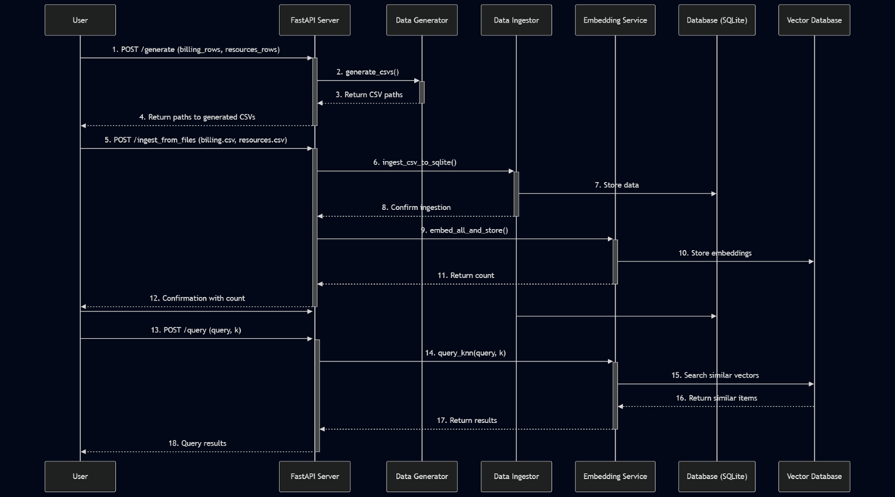
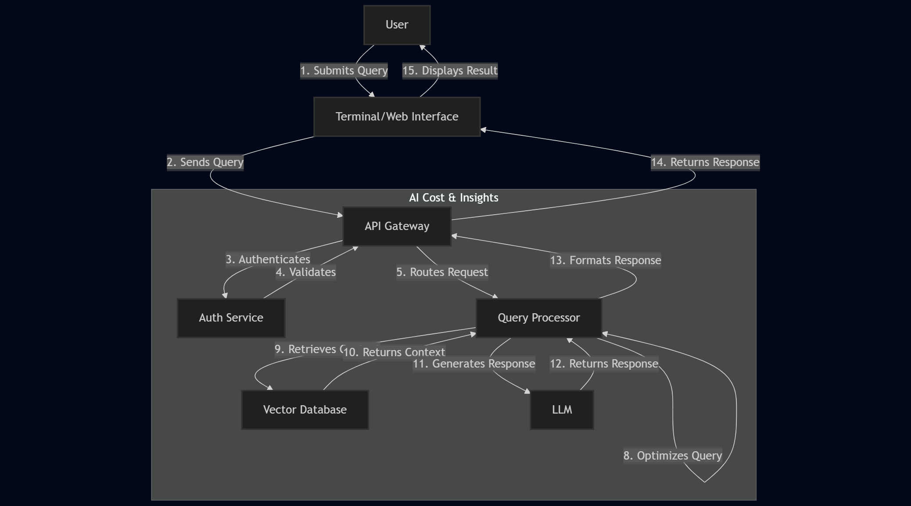

# AI Cost & Insights

A powerful tool for analyzing and managing cloud costs and resources using AI-powered insights and natural language processing.

## 🚀 Features

- **Natural Language Queries**: Ask questions about your cloud costs and resources in plain English
- **Cost Analysis**: Get detailed breakdowns of your cloud spending by service, resource, and time period
- **Resource Management**: Track and manage your cloud resources with detailed metadata
- **AI-Powered Insights**: Leverage RAG (Retrieval-Augmented Generation) for intelligent responses
- **Terminal Interface**: Interact with the system directly from your command line
- **REST API**: Built with FastAPI for easy integration with other tools

## 🛠️ Project Structure

```
AI_Cost & Insights/
├── app/                      # Main application code
│   ├── api/                  # API endpoints and routes
│   │   ├── routes.py         # API route definitions
│   │   └── schemas.py        # Pydantic models for request/response
│   ├── db/                   # Database models and operations
│   │   ├── base.py           # Database connection and base models
│   │   ├── crud.py           # Database CRUD operations
│   │   └── models.py         # SQLAlchemy models
│   ├── services/             # Business logic services
│   │   ├── embedder.py       # Text embedding and vector search
│   │   ├── generator.py      # Synthetic data generation
│   │   └── ingestor.py       # Data ingestion and processing
│   ├── configs.py            # Application configuration
│   └── main.py               # FastAPI application entry point
├── data/                     # Data storage
│   ├── db/                   # SQLite database files
│   └── synthetic/            # Sample synthetic data
├── scripts/                  # Utility scripts
│   ├── evaluate.py           # Model evaluation
│   ├── generate_sample.py    # Data generation
│   └── ingest.py             # Data ingestion
└── terminal_rag.py           # Terminal interface for RAG system
```

## 🚀 Getting Started

### Prerequisites

- Python 3.12.7
- pip (Python package manager)

### Installation

1. Clone the repository:
   ```bash
   git clone <repository-url>
   cd AI_Cost-Insights
   ```

2. Create and activate a virtual environment:
   ```bash
   python -m venv venv
   source venv/bin/activate  # On Windows: venv\Scripts\activate
   ```

3. Install dependencies:
   ```bash
   pip install -r requirements.txt
   ```

### Configuration

1. Copy `.env.example` to `.env` and update the configuration values:
   ```bash
   cp .env.example .env
   ```

2. Update the environment variables in `.env` as needed.

## 🏃 Running the Application

### Terminal Interface

Run the terminal-based interface:
```bash
python terminal_rag.py
```

### Web API

Start the FastAPI server:
```bash
uvicorn app.main:app --reload
```

The API will be available at `http://localhost:8000`

## 📚 Usage Examples

### Terminal Interface

```bash
# Get cost breakdown by service
> What is total cost of AI service?

# Find resources by owner
> List down all the service we used.

# Get cost trends
> Give all the details of resource id res-822fe7a8.
```

### API Endpoints

- `GET /api/generate` 
- `GET /api/ingest_from_files` 
- `POST /api/query`

## 🤝 Contributing

1. Fork the repository
2. Create a feature branch
3. Commit your changes
4. Push to the branch
5. Open a pull request

## 📄 License

This project is licensed under the MIT License - see the [LICENSE](LICENSE) file for details.


## Architecture :





## 📈 Future Roadmap

- [ ] Multi-cloud support (AWS, Azure, GCP)
- [ ] Automated cost optimization recommendations
- [ ] Team-based access control
- [ ] Custom report generation
- [ ] Integration with CI/CD pipelines
- 
## Future Work :


